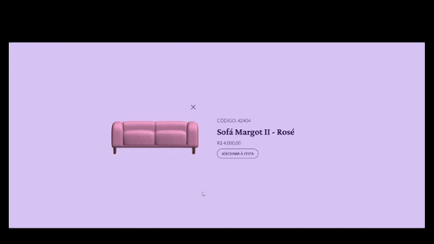

<!-- Please update value in the {}  -->

<h1 align="center">Card de Produto - Desafio Semana 2 #boraCodar</h1>

    Solução para o desafio da semana 2 do <a href="https://boracodar.dev/" target="_blank">BoraCodar.dev</a>

  <h3>
    <a href="https://helpful-faun-f31278.netlify.app/">
      Demo
    </a>
     | 
    <a href="https://github.com/viniborges/product-card-3d">
      Solução
    </a>
     | 
    <a href="https://boracodar.dev/">
      Desafio
    </a>
  </h3>

## Overview

Neste desafio também o Vite e React com Typescript.   
Sem súvida o mais desafiador foi introduzir um objeto 3d para possibilitar a visualização 360º do produto. Utilizei um objeto 3d da biblioteca do <a href="https://spline.design/">Spline</a> como base. Também utilizei o Spline para exportar a cena para o React, bem como a lib deles para trabalhar com o objeto 3d no projeto (@splinetool/react-spline).   

> Obs¹: No primeiro load o objeto demora um pouco para carregar. Tentei aplicar o lazy load para contornar esse problema, mas sem sucesso. Além disso, quando alteramos a visualização, existe um delay até o 3d ser renderizado ;(

> Obs²: Pra quem esta procurando uma solução mais elegante e com uma experiência melhor, recomendo dar uma olhada no código do <a href="https://github.com/thrsouza/bora-codar-2023-02-product-card">@thsouza</a>

### Built With

- React
- Vite
- Typescript
- Spline

## Contact

- GitHub [@viniborges](https://github.com/viniborges)
- Linkedin [luisvinicius](https://https://www.linkedin.com/in/luisvinicius/)
